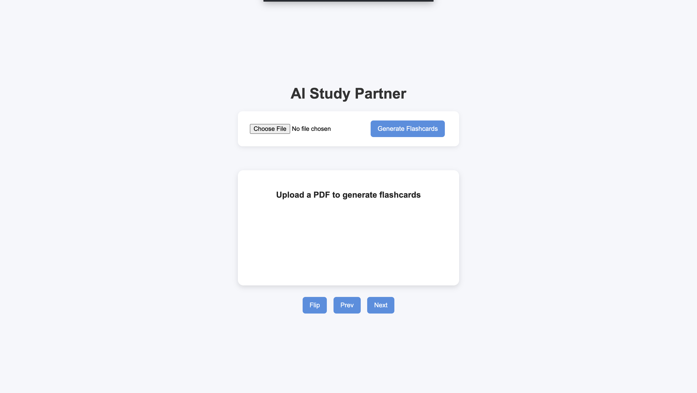

# AI Study Pal

A simple AI flashcard app that allows users to upload a PDF, extract its contents, generate study flashcards using Gemini, and review them through a web interface.



## Start Backend

```bash
cd backend
source venv/bin/activate
uvicorn main:app --reload
```

## Start Frontend

```bash
cd frontend
python3 -m http.server 5500
```

## Open Application

```text
http://127.0.0.1:5500
```
